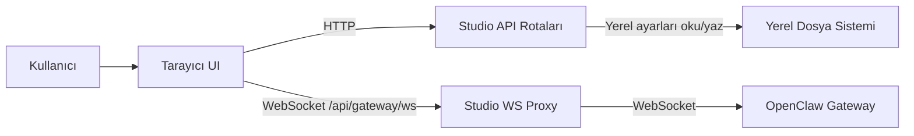

# Mimari

## Genel Bakış
Claw3D, Three.JS framework'ü kullanan ve OpenClaw tarafından desteklenen AI agent'larını görselleştirip çalıştırmak için tasarlanmış, gateway-öncelikli bir Next.js uygulamasıdır.

Claw3D, OpenClaw runtime'ının kendisi değil; UI ve proxy katmanıdır. OpenClaw, agent'lar, oturumlar ve yürütme için kayıt sistemi olmaya devam ederken Claw3D şunları sağlar:

- sohbet, onaylar, ayarlar ve runtime izleme için bir `/agents` çalışma alanı,
- agent faaliyetini uzamsal hale getiren bir `/office` 3D ortamı,
- ofis düzenlerini düzenlemek için bir `/office/builder` yüzeyi,
- tarayıcıyı yukarı akış OpenClaw gateway'ine bağlayan Studio tarafı ayarlar ve proxy katmanı.

## Hedefler
- OpenClaw'u runtime state'i için gerçeğin kaynağı olarak tutmak.
- Yerel Studio state'ini UI tercihleri ve bağlantı ayarlarıyla sınırlı tutmak.
- Hem yerel hem de uzak gateway kurulumlarını desteklemek.
- Tarayıcı kodu, sunucu kodu ve gateway'e ait veriler arasındaki net sınırları korumak.
- Büyük paylaşılan soyutlamalar yerine özellik odaklı modülleri tercih etmek.

## Hedef Dışı Konular
- Çok kullanıcılı veya çok kiracılı koordinasyon.
- OpenClaw'u yürütme motoru olarak değiştirme.
- Gateway'e ait agent state'ini yerel frontend depolamasına taşıma.

## Sistem Modeli
Claw3D dört ana parçaya ayrılmıştır:

1. **Tarayıcı UI.**
   Next.js istemcisi agents çalışma alanını, ofisi ve builder'ı render eder.
2. **Studio API rotaları.**
   Sunucu rotaları, yerel ayarları ve diğer yalnızca sunucu taraflı işlemleri yönetir.
3. **Studio WebSocket proxy.**
   Özel bir Node sunucusu, `/api/gateway/ws` adresindeki tarayıcı WebSocket bağlantılarını sonlandırır ve yukarı akış OpenClaw gateway'ine yönlendirir.
4. **OpenClaw gateway.**
   Gateway, agent kayıtlarına, oturumlara, yapılandırmaya, onaylara ve runtime olaylarına sahiptir.

## Temel Sınırlar

### 1. Gateway'e ait state
Agent kayıtları, oturumlar, onaylar, runtime akışları ve agent dosyaları OpenClaw'a aittir.

Claw3D bu state'i gateway API'leri aracılığıyla okuyabilir ve değiştirebilir, ancak rakip bir yerel gerçek kaynağı oluşturmamalıdır.

### 2. Studio'ya ait yerel state
Studio aşağıdaki gibi yerel ayarları depolar:

- gateway URL'si ve token'ı,
- odaklanmış agent ve ilgili UI tercihleri,
- ofis düzeni ve yerel sunum state'i.

Bu ayarlar, yerel OpenClaw state dizininde bulunur ve doğrudan tarayıcıdan değil, sunucu rotaları aracılığıyla erişilir.

### 3. İstemci-sunucu sınırı
İstemci bileşenleri yerel dosya sistemini doğrudan okuyup yazmamalıdır.

Dosyalara, ortam destekli ayarlara veya SSH yardımcılarına dokunan her şey sunucu tarafında kalmalıdır.

### 4. Tarayıcı-gateway sınırı
Tarayıcı, yukarı akış gateway'ine doğrudan bağlanmaz. Aynı kaynaklı bir WebSocket üzerinden Studio'ya bağlanır ve Studio, yukarı akış gateway bağlantısını sunucuda açar.

Bu, yukarı akış bağlantısını sunucu tarafından yönetilen hale getirir ve yerel, uzak ile tünellenmiş kurulumların desteklenmesini kolaylaştırır. Mevcut UI, yapılandırılmış yukarı akış URL'sini/token'ını runtime'da tarayıcı belleğine hâlâ yüklemektedir, bu nedenle tarayıcı aktif güven sınırının bir parçası olmaya devam etmektedir.

## Ana Akışlar

### Bağlantı akışı
1. UI, `/api/studio`'dan Studio ayarlarını yükler.
2. Tarayıcı `/api/gateway/ws`'e bir WebSocket açar.
3. Studio proxy, yukarı akış gateway URL'sini ve token'ını sunucu tarafında yükler.
4. Studio, yukarı akış gateway bağlantısını açar ve tarayıcı ile gateway arasındaki frame'leri yönlendirir.

### Agent runtime akışı
1. UI, Studio proxy üzerinden bağlanır ve gateway state'ini talep eder.
2. Runtime olayları, gateway'den agents UI'ına akış halinde gelir.
3. Agents çalışma alanı, sohbeti, durumu, onayları ve özetleri o olay akışından türetir.
4. Ofis görünümü, animasyonu ve oda faaliyetini aynı temel runtime sinyallerinden türetir.

### Ofis akışı
1. Ofis, agent runtime state'ini abone olarak takip eder.
2. Olay tetikleyici mantığı, runtime faaliyetini uzamsal ipuçlarına dönüştürür.
3. 3D sahne, türetilmiş state'ten agent hareketini, oda faaliyetini ve geçici janitor/sıfırlama davranışını render eder.

## Repo Yapısı
- `src/app`: rotalar, düzenler ve API endpoint'leri.
- `src/features/agents`: agents çalışma alanı UI'ı ve agent-runtime state yönetimi.
- `src/features/office`: ofis ekranları, paneller ve builder UI'ı.
- `src/features/retro-office`: 3D sahne, navigasyon, aktörler ve render yardımcıları.
- `src/lib`: gateway adaptörleri, Studio ayarları, ofis türetme mantığı ve paylaşılan yardımcılar.
- `server`: özel Studio sunucusu ve WebSocket proxy.

Pratik katkıda bulunan kod haritası ve genişletme rehberi için bkz. `CODE_DOCUMENTATION.md`.

## Tasarım İlkeleri
- **Gateway öncelikli.** Veri runtime'a aitse OpenClaw'da yaşamalı, yerel bir frontend dosyasında değil.
- **Türetilmiş UI state, kopyalanmış state yerine.** UI, paralel kayıtlar oluşturmak yerine gateway olaylarından ve yerel tercihlerden görünümler türetmelidir.
- **Özellik-önce organizasyon.** Çoğu UI mantığını özellik modülleri içinde tutun ve yalnızca gerçekten paylaşılan yardımcıları `src/lib`'e taşıyın.
- **Dar sunucu sınırları.** Dosya sistemi erişimi, SSH yardımcıları ve token yönetimi sunucu tarafında kalmalıdır.
- **Kararlı mimari belgeler.** Bu belge, her yardımcıyı, hook'u veya iş akışı dosyasını değil; sınırları ve amacı tanımlamalıdır.

## Önemli Kararlar
- **Yerel ayarlar veritabanı yerine JSON destekli bir depo kullanır.** Bu, uygulamayı basit ve yerel-öncelikli tutar; çok kullanıcılı destek pahasına.
- **Tarayıcı trafiği, gateway'e doğrudan bağlanmak yerine aynı kaynaklı Studio proxy üzerinden geçer.** Bu bir atlama ekler, ancak kimlik bilgilerini sunucu tarafında tutar ve dağıtım esnekliğini artırır.
- **Agent yapılandırması ve dosyaları gateway API'leri aracılığıyla yönetilir.** Bu, Claw3D ile yukarı akış runtime arasındaki sapmaları önler.
- **Ofis davranışı, zorunlu sahne mutasyonları yerine türetilmiş olay state'inden yönlendirilir.** Bu, 3D katmanını daha yeniden üretilebilir ve test edilebilir kılar.

## Kısıtlamalar
- Gateway token'larını veya sırlarını istemci tarafı kalıcı depolamada saklamayın.
- İstemci bileşenlerinden yerel dosyaları okuyup yazmayın.
- Gateway dışında agent kayıtları için ikinci bir gerçek kaynağı eklemeyin.
- Gateway'e ait agent yapılandırmasını doğrudan yerel OpenClaw yapılandırma dosyalarına yazmayın.
- `/api/studio` o sorumluluğa zaten sahipken paralel Studio ayarları endpoint'leri eklemeyin.
- Net bir ihtiyaç olmadan ağır soyutlamalar eklemeyin.

## Gelecekteki Yön
- Çok kullanıcılı destek önemli hale gelirse yerel ayarlar deposunu servis destekli bir kalıcılık katmanıyla değiştirin ve API sınırına kimlik doğrulaması ekleyin.
- Gateway protokolü değişirse etkiyi `src/lib/gateway` ve Studio proxy sınırı içinde izole tutun.

Mevcut yayın uyarıları ve çözüme kavuşturulmamış takip maddeleri için bkz. `KNOWN_ISSUES.md`.

## Diyagram

